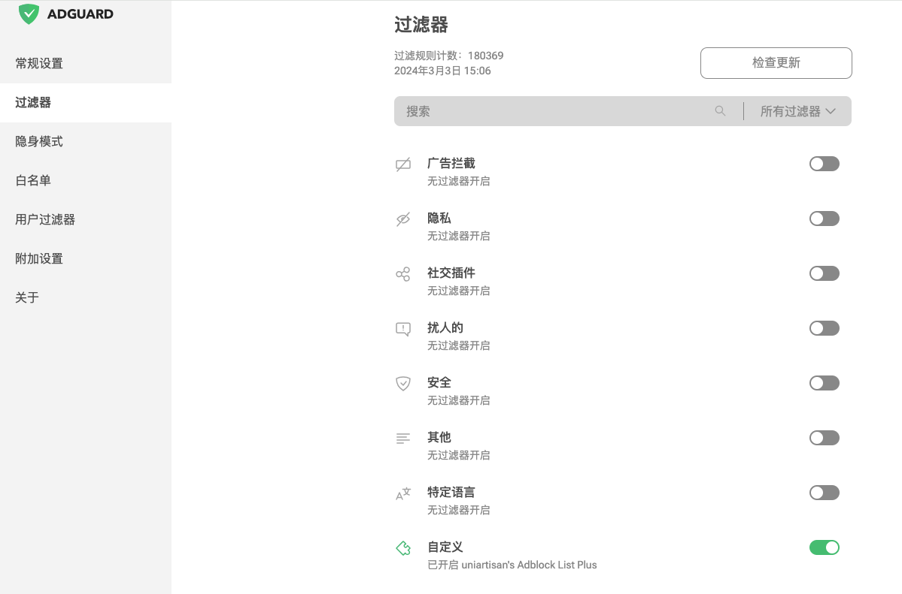
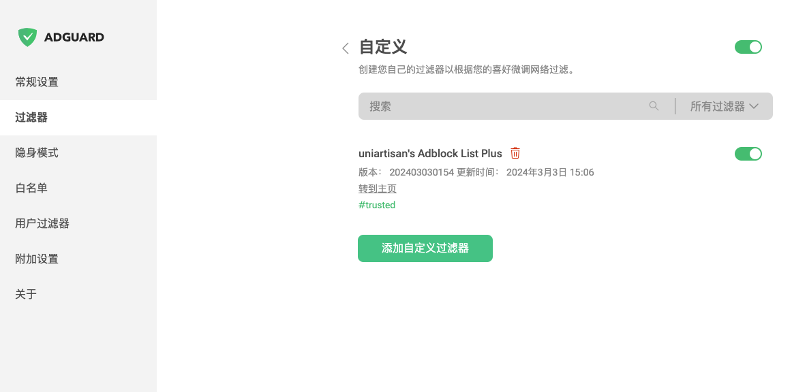

# 去广告过滤规则记录

## 浏览器插件推荐使用 uBlock、AdGuard

- uBlock 地址：https://github.com/gorhill/uBlock

- Adguard插件 地址：https://github.com/AdguardTeam/AdguardBrowserExtension

### uBlock 比较稳定的版本推荐
- 1.29.2
  - [chrome内核版插件下载](https://github.com/gorhill/uBlock/releases/download/1.29.2/uBlock0_1.29.2.chromium.zip)
  - [chrome内核版插件加速下载](https://mirror.ghproxy.com/https://github.com/gorhill/uBlock/releases/download/1.29.2/uBlock0_1.29.2.chromium.zip)

- 1.39.2 https://github.com/gorhill/uBlock/releases/tag/1.39.2
  - [chrome内核版插件下载](https://github.com/gorhill/uBlock/releases/download/1.39.2/uBlock0_1.39.2.chromium.zip)
  - [chrome内核版插件加速下载](https://mirror.ghproxy.com/https://github.com/gorhill/uBlock/releases/download/1.39.2/uBlock0_1.39.2.chromium.zip)

- 1.48.8 https://github.com/gorhill/uBlock/releases/tag/1.48.8
  - [chrome内核版插件下载](https://github.com/gorhill/uBlock/releases/download/1.48.8/uBlock0_1.48.8.chromium.zip)
  - [chrome内核版插件加速下载](https://mirror.ghproxy.com/https://github.com/gorhill/uBlock/releases/download/1.48.8/uBlock0_1.48.8.chromium.zip)

2024.3.3记录：uBlock Origin 过滤存在的问题是是订阅规则引起的，订阅一条 uniartisan 合并的规则+“内置”栏目的规则就正常了。另外使用 uBlock Origin 1.56.0 解压后安装到 Chrome(版本122)，这个插件首次启动特别卡顿，crx直接装不会卡顿，而使用 AdGuard 4.3.13 插件不管是解压后安装还是crx拖动安装都非常流畅。

### 小提示
- 不要使用 火狐 firefox 以及火狐内核那一类的浏览器，安卓同一手机上面打开同一个网站，火狐内核的浏览器上下滚动页面会比较卡顿，而谷歌 chromium 内核的流畅。
- 而 Yandex 安卓版虽然可以安装插件，但是许多站点的视频 Yandex 浏览器无法正常加载播放，套壳的浏览器反而可以正常播放。
- AdGuard插件安装在 kiwi 浏览器上面使用自定义订阅的过滤器规则不会自动更新，电脑端Chrome则正常，手机端kiwi浏览器不建议使用 AdGuard 插件，推荐使用 uBlock Origin 插件

## 电脑浏览器插件规则方案建议:
- uBlock插件订阅方案，保留“内置”订阅，然后订阅一条由 uniartisan 合并的规则即可
  - 订阅参考图：
  

- AdGuard插件订阅方案，订阅一条由 uniartisan 合并的规则即可
  - 具体步骤 “设置选项” --> “过滤器” --> “自定义” --> “添加自定义过滤器”
  - 订阅参考图：
  
  
  

- uniartisan合并的规则订阅链接：
  - github 原始 raw 订阅链接：
    - [https://raw.githubusercontent.com/uniartisan/adblock_list/master/adblock_plus.txt](https://raw.githubusercontent.com/uniartisan/adblock_list/master/adblock_plus.txt)
  - gitee 订阅链接1【推荐】:
    - [https://gitee.com/uniartisan2018/adblock_list/raw/master/adblock_plus.txt](https://gitee.com/uniartisan2018/adblock_list/raw/master/adblock_plus.txt)
> 注意：adguard插件(Chrome浏览器)测试，经过 ghproxy 加速站点的加速订阅后不会自动更新订阅
> 
> 另外 jsdelivr 加速的话比较慢，这种合并的规则文件比较大，加速下载下来比较费劲，经常失败，不建议使用

## 一些项目地址
- [adblock_list](https://github.com/uniartisan/adblock_list)

- [https://adrules.top](https://adrules.top)

- [https://gitlab.com/cats-team/adrules](https://gitlab.com/cats-team/adrules)

- [https://gitea.com/lemon399/AdRules](https://gitea.com/lemon399/AdRules)

- [GOODBYEADS](https://github.com/8680/GOODBYEADS)

- [AdRules](https://github.com/Luphraim/AdRules)

- [安卓端支持插件的浏览器 kiwibrowser](https://github.com/kiwibrowser/src.next)

## 移动端浏览器订阅推荐
### Via
- 订阅任意一条即可：
  - [https://adrules.top/adblock_plus.txt](https://adrules.top/adblock_plus.txt)
  - [https://gitee.com/uniartisan2018/adblock_list/raw/master/adblock_plus.txt](https://gitee.com/uniartisan2018/adblock_list/raw/master/adblock_plus.txt)
  - [https://gitlab.com/cats-team/adrules/-/raw/main/adblock_plus.txt](https://gitlab.com/cats-team/adrules/-/raw/main/adblock_plus.txt)
  - [https://raw.githubusercontent.com/PhoenixLjw/AdRules/main/filter.txt](https://raw.githubusercontent.com/PhoenixLjw/AdRules/main/filter.txt)

