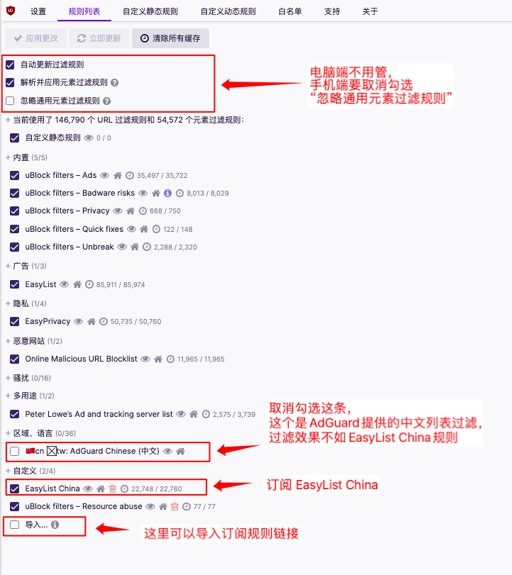
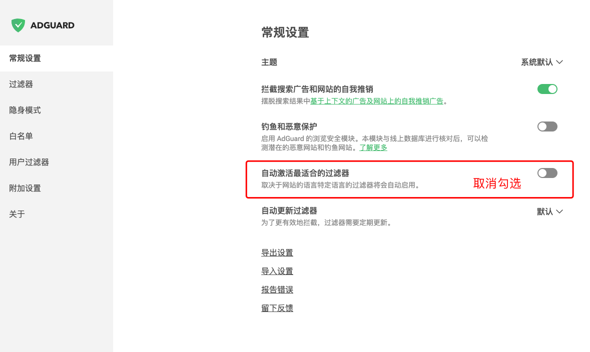

# 去广告过滤规则记录

## 浏览器插件推荐使用 uBlock、AdGuard

>  uBlock 地址: https://github.com/gorhill/uBlock

>  Adguard插件 地址: https://github.com/AdguardTeam/AdguardBrowserExtension

## uBlock 比较稳定的版本推荐

> 1.29.2

[Chromium内核版下载](https://github.com/gorhill/uBlock/releases/download/1.29.2/uBlock0_1.29.2.chromium.zip)

> 1.39.2

[Chromium内核版下载](https://github.com/gorhill/uBlock/releases/download/1.39.2/uBlock0_1.39.2.chromium.zip)

> 1.48.8

[Chromium内核版下载](https://github.com/gorhill/uBlock/releases/download/1.48.8/uBlock0_1.48.8.chromium.zip)

## 一些使用记录

>  Yandex 安卓版虽然可以安装插件，但是许多站点的视频 Yandex 浏览器无法正常加载播放，套壳的浏览器反而可以正常播放。

> 2024.3.3记录: uBlock Origin 过滤存在的问题是是订阅规则引起的，订阅一条 uniartisan 合并的规则+“内置”栏目的规则就正常了。另外使用 uBlock Origin 1.56.0 解压后安装到 Chrome(版本122)，这个插件首次启动特别卡顿，crx直接装不会卡顿，而使用 AdGuard 4.3.13 插件不管是解压后安装还是crx拖动安装都非常流畅。

> 2024.4.17 AdGuard 插件: jsdelivr 加速的、gitee的链接、ghproxy加速的订阅的链接不会自动更新，原因是合并的规则文件太大，经常无法订阅或订阅失败，而 ABP 官方提供的订阅链接则正常自动更新

> uBlock 插件: jsdelivr 加速的文件 7M 以上的不会自动更新，7M以下的没有试过，gitee的链接则可以正常自动更新10M左右的规则文件
> 
> Brave 浏览器自带的广告拦截(其实就是内置了uBlock插件): jsdelivr 加速的大文件不会自动更新，gitee 的订阅链接和 uBlock 插件一样正常自动更新

## 规则列表

- EasyList
  - 用途：过滤英文站点广告
  - 订阅链接：[https://easylist-downloads.adblockplus.org/easylist.txt](https://easylist-downloads.adblockplus.org/easylist.txt)
- EasyList China
  - 用途：过滤中文站点广告
  - 订阅链接：[https://easylist-downloads.adblockplus.org/easylistchina.txt](https://easylist-downloads.adblockplus.org/easylistchina.txt)
- EasyPrivacy
  - 用途：隐私防护
  - 订阅链接：[https://easylist-downloads.adblockplus.org/easyprivacy.txt](https://easylist-downloads.adblockplus.org/easyprivacy.txt)
- 乘风视频过滤
  - 用途：过滤哎呦疼视频广告
  - 订阅链接：[https://cdn.jsdelivr.us/gh/xinggsf/Adblock-Plus-Rule@master/mv.txt](https://cdn.jsdelivr.us/gh/xinggsf/Adblock-Plus-Rule@master/mv.txt)
- uniartisan 合并的规则
  - 用途：集合了EasyList、EasyList China等规则，多合一
  - 订阅链接：[https://gitee.com/uniartisan2018/adblock_list/raw/master/adblock_plus.txt](https://gitee.com/uniartisan2018/adblock_list/raw/master/adblock_plus.txt)
  - 备注：非必要不建议使用，因为一般插件内有上面那些规则可以单独订阅，这个集合的单文件体积太大，订阅时比较容易出现卡顿/失败

## 浏览器插件规则方案建议
### uBlock插件订阅方案

#### A方案

插件默认订阅即可，如果需要过滤一些哎哟疼的广告，可额外订阅一条乘风的过滤规则

##### 订阅参考图

#### B方案:

保留“内置”订阅，然后订阅一条由 uniartisan 合并的规则即可，可参考以下图订阅

##### 订阅参考图

### AdGuard 插件订阅方案

#### 设置一下 AdGuard

#### A方案

AdGuard 安装后默认订阅的内容，如果因为网络原因没有成功订阅，那么参考一下图片去订阅即可。不过还是建议使用方案C

##### 订阅参考图

#### B方案

> 和 C 方案区别就是用的这几个是 AdGuard 提供的镜像规则，是从 ABP 官方那边镜像过来的

订阅 EasyList、EasyList China、EasyPrivacy

具体步骤 

第一步：“设置选项” --> “过滤器” --> “广告拦截” --> “EasyList”

第二步：“设置选项” --> “过滤器” --> “隐私” --> “EasyPrivacy”

第三步：“设置选项” --> “过滤器” --> “特定语言” --> “EasyList中国”

##### 订阅参考图

#### C 方案【推荐】

> 和 B 方案区别就是用的这几个是从 ABP 官方那边的，ABP规则的链接加载速度比较快

订阅 EasyList、EasyList China、EasyPrivacy

具体步骤 “设置选项” --> “过滤器” --> “自定义” --> “添加自定义过滤器”

##### 订阅参考图

#### D方案

订阅一条由 uniartisan 合并的规则即可

具体步骤 “设置选项” --> “过滤器” --> “自定义” --> “添加自定义过滤器”

##### 订阅参考图

## 一些项目地址
[推荐阅读 cjxlist](https://github.com/cjx82630/cjxlist)

[乘风过滤规则](https://github.com/xinggsf/Adblock-Plus-Rule)

> 备注: 针对哎哟疼的比较强大

[安卓端支持插件的浏览器 kiwibrowser](https://github.com/kiwibrowser/src.next)

[安卓端支持firefox插件的浏览器 iceraven-browser](https://github.com/fork-maintainers/iceraven-browser)

