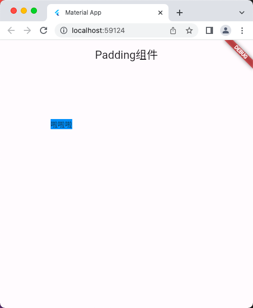
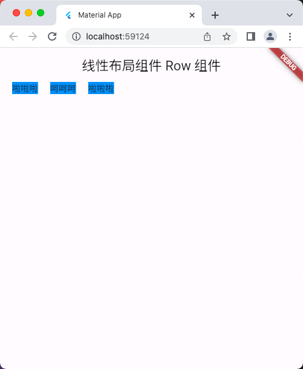
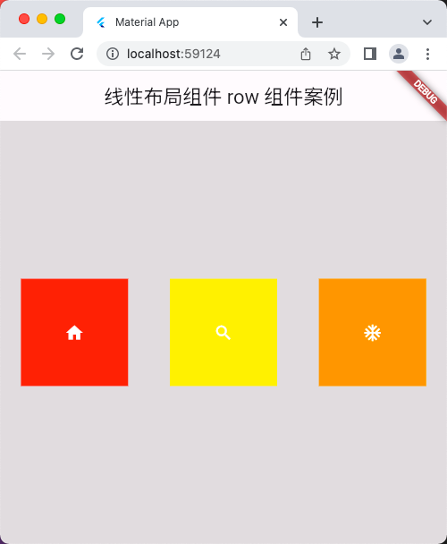
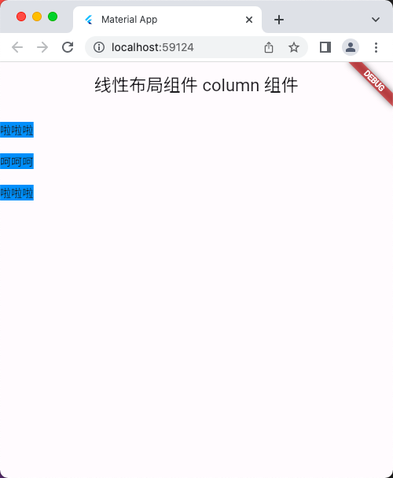
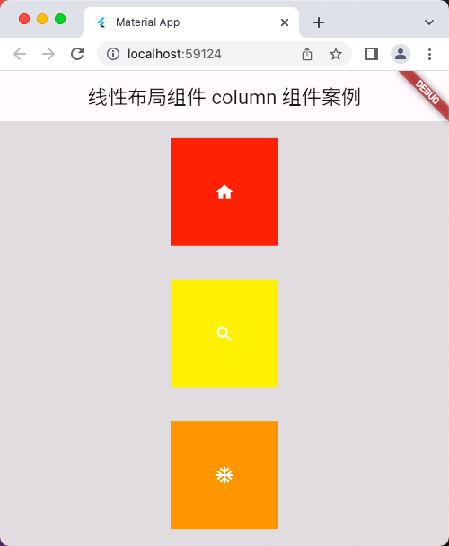
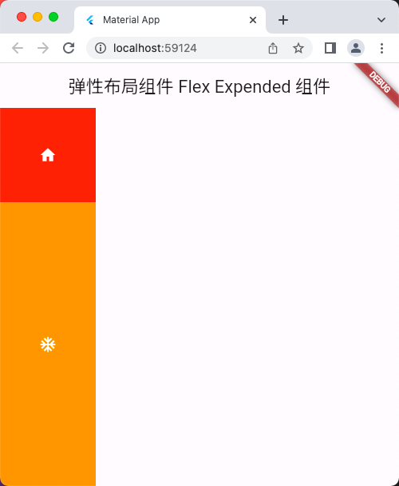
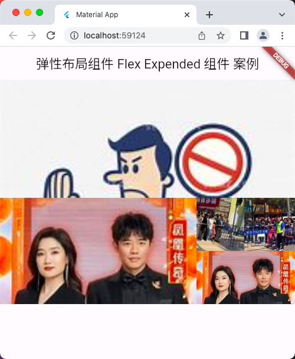

# 基础组件

## Padding组件
```dart
import 'package:flutter/material.dart';

void main() => runApp(const MyApp());

class MyApp extends StatelessWidget {
  const MyApp({super.key});

  @override
  Widget build(BuildContext context) {
    return MaterialApp(
      title: 'Material App',
      home: Scaffold(
        appBar: AppBar(
          title: const Text('Padding组件'),
        ),
        body: const HomePage(),
      ),
    );
  }
}

class HomePage extends StatelessWidget {
  const HomePage({super.key});

  @override
  Widget build(BuildContext context) {
    return Padding(
      padding: const EdgeInsets.all(100), // 如果只是想要设置内边距，用 Padding 组件去包裹就好了。
      child: Container(
        decoration: const BoxDecoration(
          color: Colors.blue,
        ),
        child: const Text('啦啦啦'),
      ),
    );
  }
}
```
运行示意图：


## 线性布局组件 Row 组件
```dart
import 'package:flutter/material.dart';

void main() => runApp(const MyApp());

class MyApp extends StatelessWidget {
  const MyApp({super.key});

  @override
  Widget build(BuildContext context) {
    return MaterialApp(
      title: 'Material App',
      home: Scaffold(
        appBar: AppBar(
          title: const Text('线性布局组件 Row 组件'),
        ),
        body: const HomePage(),
      ),
    );
  }
}

class HomePage extends StatelessWidget {
  const HomePage({super.key});

  @override
  Widget build(BuildContext context) {
    return Row(
      mainAxisAlignment: MainAxisAlignment.start, // 主轴排序方式
      crossAxisAlignment: CrossAxisAlignment.start, // 次轴排序方式
      children: [
        const SizedBox(
          width: 20,
          height: 20,
        ),
        Container(
          decoration: const BoxDecoration(
            color: Colors.blue,
          ),
          child: const Text('啦啦啦'),
        ),
        const SizedBox(
          width: 20,
          height: 20,
        ),
        Container(
          decoration: const BoxDecoration(
            color:  Colors.blue,
          ),
          child: const Text('呵呵呵'),
        ),
        const SizedBox(
          width: 20,
          height: 20,
        ),
        Container(
          decoration: const BoxDecoration(
            color: Colors.blue,
          ),
          child: const Text('啦啦啦'),
        ),
      ],
    );
  }
}
```
运行示意图：


## 线性布局组件 row 组件案例
```dart
import 'package:flutter/material.dart';

void main() => runApp(const MyApp());

class MyApp extends StatelessWidget {
  const MyApp({super.key});

  @override
  Widget build(BuildContext context) {
    return MaterialApp(
      title: 'Material App',
      home: Scaffold(
        appBar: AppBar(
          title: const Text('线性布局组件 row 组件案例'),
        ),
        body: const HomePage(),
      ),
    );
  }
}

class HomePage extends StatelessWidget {
  const HomePage({super.key});

  @override
  Widget build(BuildContext context) {
    return Center(
      child: Container(
        // width: 400,
        // width: double.infinity, // 无穷大，可以让当前的容器撑满父容器
        width: double.maxFinite, // 无穷大，可以让当前的容器撑满父容器
        // height: 700,
        height: double.infinity, // 无穷大，可以让当前的容器撑满父容器
        color: Colors.black12,
        child: const Row(
          // mainAxisAlignment: MainAxisAlignment.center,
          mainAxisAlignment: MainAxisAlignment.spaceAround,
          crossAxisAlignment: CrossAxisAlignment.center, // 需要外面有个容器组件，才会生效
          // crossAxisAlignment: CrossAxisAlignment.start, // 需要外面有个容器组件，才会生效
          // crossAxisAlignment: CrossAxisAlignment.end, // 需要外面有个容器组件，才会生效
          // crossAxisAlignment: CrossAxisAlignment.stretch, // 需要外面有个容器组件，才会生效
          children: [
            IconContainer(
              Icons.home,
            ),
            IconContainer(
              Icons.search,
              color: Colors.yellow,
            ),
            IconContainer(
              Icons.ac_unit_sharp,
              color: Colors.orange,
            ),
          ],
        ),
      ),
    );
  }
}

// 自定义 IconContainer
class IconContainer extends StatelessWidget {
  final Color color;
  final IconData icon;
  // 注意：这里的 icon 不能 写成命名参数，因为那样会导致无法传递进入
  // const IconContainer({super.key, this.color = Colors.red, this.icon}); // 错误的写法
  const IconContainer(this.icon, {super.key, this.color = Colors.red});

  @override
  Widget build(BuildContext context) {
    return Container(
      alignment: Alignment.center,
      height: 120,
      width: 120,
      color: color,
      child: Icon(
        icon,
        color: Colors.white,
        size: 22,
      ),
      // child: Icon(icon),
    );
  }
}
```
运行示意图：


## 线性布局组件 column 组件
```dart
import 'package:flutter/material.dart';

void main() => runApp(const MyApp());

class MyApp extends StatelessWidget {
  const MyApp({super.key});

  @override
  Widget build(BuildContext context) {
    return MaterialApp(
      title: 'Material App',
      home: Scaffold(
        appBar: AppBar(
          title: const Text('线性布局组件 column 组件'),
        ),
        body: const HomePage(),
      ),
    );
  }
}

class HomePage extends StatelessWidget {
  const HomePage({super.key});

  @override
  Widget build(BuildContext context) {
    return Column(
      mainAxisAlignment: MainAxisAlignment.start, // 主轴排序方式
      crossAxisAlignment: CrossAxisAlignment.start, // 次轴排序方式
      children: [
        const SizedBox(
          width: 20,
          height: 20,
        ),
        Container(
          decoration: const BoxDecoration(
            color: Colors.blue,
          ),
          child: const Text('啦啦啦'),
        ),
        const SizedBox(
          width: 20,
          height: 20,
        ),
        Container(
          decoration: const BoxDecoration(
            color: Colors.blue,
          ),
          child: const Text('呵呵呵'),
        ),
        const SizedBox(
          width: 20,
          height: 20,
        ),
        Container(
          decoration: const BoxDecoration(
            color: Colors.blue,
          ),
          child: const Text('啦啦啦'),
        ),
      ],
    );
  }
}
```
运行示意图：


## 线性布局组件 column 组件案例
```dart
import 'package:flutter/material.dart';

void main() => runApp(const MyApp());

class MyApp extends StatelessWidget {
  const MyApp({super.key});

  @override
  Widget build(BuildContext context) {
    return MaterialApp(
      title: 'Material App',
      home: Scaffold(
        appBar: AppBar(
          title: const Text('线性布局组件 column 组件案例'),
        ),
        body: const HomePage(),
      ),
    );
  }
}

class HomePage extends StatelessWidget {
  const HomePage({super.key});

  @override
  Widget build(BuildContext context) {
    return Container(
      // width: 400,
      // width: double.infinity, // 无穷大，可以让当前的容器撑满父容器
      width: double.maxFinite, // 无穷大，可以让当前的容器撑满父容器
      // height: 700,
      height: double.infinity, // 无穷大，可以让当前的容器撑满父容器
      color: Colors.black12,
      child: const Column(
        // mainAxisAlignment: MainAxisAlignment.center,
        mainAxisAlignment: MainAxisAlignment.spaceAround,
        crossAxisAlignment: CrossAxisAlignment.center, // 需要外面有个容器组件，才会生效
        // crossAxisAlignment: CrossAxisAlignment.start, // 需要外面有个容器组件，才会生效
        // crossAxisAlignment: CrossAxisAlignment.end, // 需要外面有个容器组件，才会生效
        // crossAxisAlignment: CrossAxisAlignment.stretch, // 需要外面有个容器组件，才会生效
        children: [
          IconContainer(
            Icons.home,
          ),
          IconContainer(
            Icons.search,
            color: Colors.yellow,
          ),
          IconContainer(
            Icons.ac_unit_sharp,
            color: Colors.orange,
          ),
        ],
      ),
    );
  }
}

// 自定义 IconContainer
class IconContainer extends StatelessWidget {
  final Color color;
  final IconData icon;
  // 注意：这里的 icon 不能 写成命名参数，因为那样会导致无法传递进入
  // const IconContainer({super.key, this.color = Colors.red, this.icon}); // 错误的写法
  const IconContainer(this.icon, {super.key, this.color = Colors.red});

  @override
  Widget build(BuildContext context) {
    return Container(
      alignment: Alignment.center,
      height: 120,
      width: 120,
      color: color,
      child: Icon(
        icon,
        color: Colors.white,
        size: 22,
      ),
      // child: Icon(icon),
    );
  }
}
```
运行示意图：


## 弹性布局组件 Flex Expended 组件
```dart
import 'package:flutter/material.dart';

/*
 注意：Row、Column组件都是继承 Flex 组件，所以能使用 Flex 的时候，
 是可以使用 Row、Column 的。

 Expanded 组件必须用在 Flex 组件，或者 Flex 的子类 Row、Column组件里面

 */

void main() => runApp(const MyApp());

class MyApp extends StatelessWidget {
  const MyApp({super.key});

  @override
  Widget build(BuildContext context) {
    return MaterialApp(
      title: 'Material App',
      home: Scaffold(
        appBar: AppBar(
          title: const Text('弹性布局组件 Flex Expended 组件'),
        ),
        body: const HomePage(),
      ),
    );
  }
}

class HomePage extends StatelessWidget {
  const HomePage({super.key});

  @override
  Widget build(BuildContext context) {
    // Expanded 组件必须用在 Flex 组件，或者 Flex 的子类 Row、Column组件里面
    /* return const Row(
      children: [
        Expanded(
          flex: 1,
          child: IconContainer( // 这个子组件设置宽度是不会有效果的，因为父组件是 Expanded 组件
            Icons.home,
          ),
        ),
        Expanded(
          flex: 3,
          child: IconContainer( // 这个子组件设置宽度是不会有效果的，因为父组件是 Expanded 组件
            Icons.ac_unit_sharp,
            color: Colors.orange,
          ),
        ),
      ],
    ); */
    return const Flex(
      // direction: Axis.horizontal, // 默认 水平方向
      direction: Axis.vertical, // 垂直方向
      children: [
        Expanded(
          flex: 1,
          child: IconContainer( // 这个子组件设置宽度是不会有效果的，因为父组件是 Expanded 组件
            Icons.home,
          ),
        ),
        Expanded(
          flex: 3,
          child: IconContainer( // 这个子组件设置宽度是不会有效果的，因为父组件是 Expanded 组件
            Icons.ac_unit_sharp,
            color: Colors.orange,
          ),
        ),
      ],
    );
  }
}

// 自定义 IconContainer
class IconContainer extends StatelessWidget {
  final Color color;
  final IconData icon;
  // 注意：这里的 icon 不能 写成命名参数，因为那样会导致无法传递进入
  // const IconContainer({super.key, this.color = Colors.red, this.icon}); // 错误的写法
  const IconContainer(this.icon, {super.key, this.color = Colors.red});

  @override
  Widget build(BuildContext context) {
    return Container(
      alignment: Alignment.center,
      height: 120,
      width: 120,
      color: color,
      child: Icon(
        icon,
        color: Colors.white,
        size: 22,
      ),
      // child: Icon(icon),
    );
  }
}
```
运行示意图：


## 弹性布局组件 Flex Expended 组件 案例
```dart
import 'package:flutter/material.dart';

/*
 注意：Row、Column组件都是继承 Flex 组件，所以能使用 Flex 的时候，
 是可以使用 Row、Column 的。
 Expanded 组件必须用在 Flex 组件，或者 Flex 的子类 Row、Column组件里面
 */
void main() => runApp(const MyApp());

class MyApp extends StatelessWidget {
  const MyApp({super.key});

  @override
  Widget build(BuildContext context) {
    return MaterialApp(
      title: 'Material App',
      home: Scaffold(
        appBar: AppBar(
          title: const Text('弹性布局组件 Flex Expended 组件 案例'),
        ),
        body: const HomePage(),
      ),
    );
  }
}

class HomePage extends StatelessWidget {
  const HomePage({super.key});

  @override
  Widget build(BuildContext context) {
    // Expanded 组件必须用在 Flex 组件，或者 Flex 的子类 Row、Column组件里面
    // Expanded 的子组件最好套上一层 SizedBox / Container 容器，这样好设置高度、宽度
    return ListView(
      children: [
        Container(
          width: double.infinity,
          height: 200,
          color: Colors.black12,
          child: Image.network(
            'https://cn.bing.com/th?id=OIP.ebP0ylWqLdfaNzxc8kdu9QHaHa&w=186&h=88&c=7&rs=2&qlt=80&pid=PopNow',
            fit: BoxFit.cover,
            // fit: BoxFit.fill,
          ),
        ),
        Row(
          children: [
            Expanded(
              flex: 2,
              child: SizedBox(
                height: 180,
                child: Image.network(
                  'https://cn.bing.com/th?id=OVFT.z3_83QAaDwz0Pa7KOX0DBi&w=186&h=88&c=7&rs=2&qlt=80&pid=PopNow',
                  fit: BoxFit.cover,
                ),
              ),
            ),
            Expanded(
              flex: 1,
              child: SizedBox(
                height: 180,
                child: Column(
                  // 这里的 Column 高度是自适应的，
                  // 不能直接用在 Expanded 组件里面，然后子组件使用
                  // Expanded 组件，需要外部套一个 SizedBox / Container 容器组件
                  // 并给 SizedBox / Container 设置高度，这样才能正常使用
                  children: [
                    Expanded(
                      flex: 1,
                      child: SizedBox(
                        width: double.maxFinite,
                        child: Image.network(
                          'https://cn.bing.com/th?id=OVFT.aduzz5eDqaVpTorCLvy2IC&w=186&h=88&c=7&rs=2&qlt=80&pid=PopNow',
                          fit: BoxFit.cover,
                        ),
                      ),
                    ),
                    Expanded(
                      flex: 1,
                      child: SizedBox(
                        width: double.infinity,
                        child: Image.network(
                          'https://cn.bing.com/th?id=OVFT.z3_83QAaDwz0Pa7KOX0DBi&w=186&h=88&c=7&rs=2&qlt=80&pid=PopNow',
                          fit: BoxFit.cover,
                        ),
                      ),
                    ),
                  ],
                ),
              ),
            ),
          ],
        ),
      ],
    );
  }
}
```
运行示意图：

